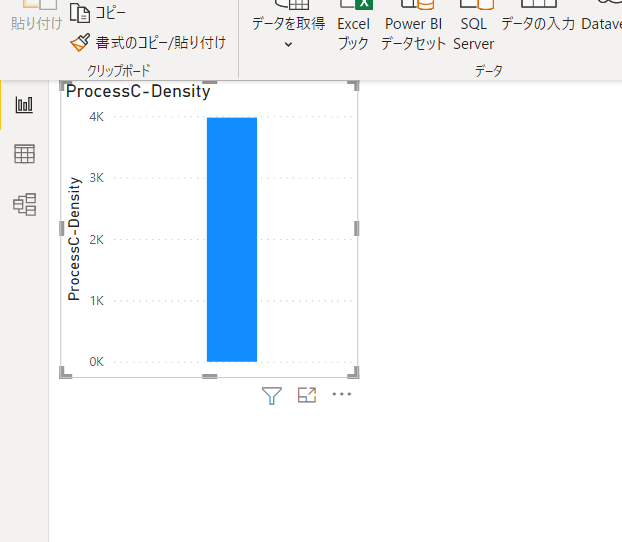
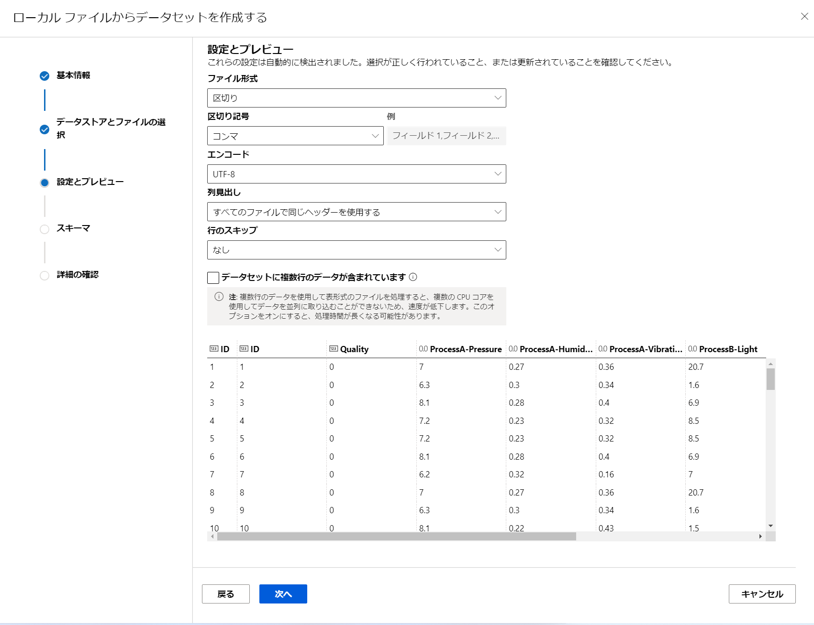

# Low Code でのデータ分析 - 工場での品質管理編

Power BI と Azure Machine Learning を使った Low-Code でのハンズオン コンテンツです。

工場での品質管理をテーマにしたデータ加工のハンズオンドキュメントです。
3つの工程のデータを元に幾つかのデータ分析を Low Code のツールのみで実施します。

# 謝辞
シナリオ・データ・Power BIファイルともに、女部田さんが作成されたもをベースにしています。
ありがとうございます!

https://github.com/konabuta


# 必要なもの

- Windows
    - Mac の方は、Azure 上の Windows 仮想マシンを使ってください。
- Power BI Desktop (無料)
  https://powerbi.microsoft.com/ja-jp/desktop/
- Azure Subscription
    - 無料版はこちらから
    - https://azure.microsoft.com/ja-jp/free/


# ファイル たち

```bash
├── data
|    ├── Factory_New.csv       : 新規に出来たデータ。機械学習の検証用です。
|    └── Factory.csv           : 過去データ。3つの工程のデータと人による品質判定結果を、生産物IDでマージしたものです。
├── final
|    └── 品質管理Factory.csv           : データ加工後に出来るファイル
└── images
```

# 1. データ

data フォルダーの `Factory.csv` を扱います。


| 項目                 | 内容          | メモ                       |
|--------------------|-------------|--------------------------|
| ID                 | 生産物のID |                          |
| Quality            | 品質判定        | 0は良品。1は不良品               |
| ProcessA-Pressure  | 圧力          |                          |
| ProcessA-Humidity  | 湿度          |                          |
| ProcessA-Vibration | 振動          |                          |
| ProcessB-Light     | 光量          |                          |
| ProcessB-Skill     | 技能調整値       | 組み込みソフトウェアでの生産物間の処理間隔調整値 |
| ProcessB-Temp      | 温度          |                          |
| ProcessB-Rotation  | 調整確度        |                          |
| ProcessC-Density   | 密度          |                          |
| ProcessC-PH        | PH値         |                          |
| ProcessC-skewness  | 歪み          |                          |
| ProcessC-Time      | 経過時間 (分)    | |  

これは1つの生産物が出来ていく工程の中の 3つのものをマージしたものです。実際には、各工程での生産物の識算出や、欠損データの処理など、データ加工をする必要があります。

# 2.データの理解 [Power BI Desktop]

どんなデータが入っているのかを見ていきます。
Power BI Desktop を使います。

  

## 2.1. データの取り込み

Power BI Desktopを起動します。
[ホーム] - [データを取得] のメニューから、`テキスト\CSV` を選択します。

  

`Factory.csv`を選択後、プレビュー画面でファイルの一部が確認できます。この画面では、特に日本語の文字化けが無いかなどを確認します。
今回はこのまま[読み込み]を押して先に進みます。

  


データの読み込みが完了すると[フィールド]のエリアでデータの各項目を確認できます。

  

## 2.2. データのプロファイル表示

現在はレポート作成画面にいます。画面左のアイコンから、真ん中の[データ]を選択して、データの確認画面に移動します。

  


[テーブル ツール] - [データの変換] を選択します。 

  

`Power Query エディター` が起動します。

  

[表示]に移動して、以下のチェックボックスに全てチェックを入れます。

- 列の品質
- 列の分布
- 列のプロファイル

  

各データ項目について簡単に確認できるようになりました。

  

因みに標準設定ですと、上位1000件でのプロファイリングになります。画面一番下で、全件と切り替えられます。

  


## 2.3. データ加工

Power Query は様々なデータの加工が出来ます。今回は必要最低限の事だけ行います。

`Quality` のデータ型が数値になっています。数値項目だと集計に何かと使われて不便です。そのため`テキスト`型に変換をします。

  

今回はこれだけです。
画面左上の[閉じて適用]を押して、Power Queryエディターを閉じて、データ加工を行ってのデータを再度読み込みます。

  


今回は割愛しますが、ドキュメントをご参考頂ければと思います。

Power BI Desktop でのクエリの概要:
https://docs.microsoft.com/ja-jp/power-bi/transform-model/desktop-query-overview

## 2.3. 散布図を使っての相関系の理解

散布図は項目同士の相関関係を見る際に良く使われます。
ここでは一例として、`Process-Density` と `ProcessC-Time` の相関関係を見ていきます。4,000件くらいありますから...わかんないすよね。Excelで眺めただけですと。


[レポート] 画面に戻ります。ここで各種`ビジュアル`を使ってグラフを作っていきます。

画面右側の[フィールド]から`Process-Density`を選択します。

  

すると中央の大きなエリアに、棒グラフが表示されます。

  


ここには**複数**のグラフを置けます。それぞれが相互作用してフィルタリングなどが出来ます。これがExcelや単体Pythonでの matplotlib などでのグラフ作成と、データ同士の相関関係を柔軟に見るダッシュボードの違いの一つです。

グラフを選択すると、そのグラフについての各種設定を[視覚化]で行えます。
`値`に、`Process-Density`が設定されているのが確認できます。

  

先ほどのグラフを選んだ状態で`散布図`を選択します。

  

グラフが散布図に変わりました!
[視覚化]を見てみると、散布図用の設定に変わっています。新たに[Y軸]などが増えています。時間に関しての項目があれば[再生軸]に置くと良いです。

  

ここでは、[フィールド]にある`ProcessC-Time`を[Y軸]にドラックアンドドロップします。

さて。せっかくデータ項目をグラフに設定したのですが、点が一つあるだけです。
これは実は**デフォルトで集計処理が動いている**からです。

  

集計処理を「オフ」にします。

[フィールド]-[X軸]の`Process-Density`のメニューを選択します。
そのメニューの中から[集計しない]を選択します。

  


[Y軸]の`ProcessC-Time`でも同じように[集計しない]を選択します。すると、以下の様にグラフの表示が変わります。
これは相関関係が強そうですね!

  

これを回帰直線で書いてみましょう。

グラフを選択したまま[視覚化]メニューの真ん中あたりのアイコンから[分析]を選択します。

  

[傾向線]から[+追加]を選んで直線を書かせましょう!
色などは自由に変えてください。

  

なんとこれだけで回帰直線を書いてくれました。

  

この[分析]は超強力です。ビジュアル毎に様々な機械学習などを使った分析機能を標準搭載しています。
こちらも併せてご参照ください。

Power BI での視覚化の種類:

https://docs.microsoft.com/ja-jp/power-bi/visuals/power-bi-visualization-types-for-reports-and-q-and-a

# 3. 要因探索

相関関係の先には、要因探索が出てきます。`Quality`に影響があるのは、どの項目なのか?項目数が100を超えるようだと散布図でも表現力、もっというと人が理解できる状態にするのが難しすぎます。
ここでは Power BI 標準機能の中の一つの`主要なインフルエンサー`のビジュアルを使っての`Quality`への影響度を見ていく例をご紹介します。


主要なインフルエンサーの視覚化を作成する:
https://docs.microsoft.com/ja-jp/power-bi/visuals/power-bi-visualization-influencers


[レポート]のグラフが何も置かれていない場所を選択します。その後[フィールド]から`Quality`を選択します。


私の画面の場合ですと、新しいグラフが見づらい場所に配置されました。
グラフの位置や大きさはドラックアンドドロップで自由に変えられます。

  


[ビジュアル]を[主要なインフルエンサー]に変更します。

  

これで[主要なインフルエンサー]のビジュアルに切り替わりました。
`Quality`が[分析]に設定されています。これは、**目的変数**としての設定になります。先ほどの例と同様、データが**集計される前提**です。そのため**数の増減**という表現になっています。

  

これも[集計しない]に変更をします。

  

後は**説明変数**を設定するだけです。
[フィールド]の各項目を、[視覚化]の[説明]に複数個ドラックアンドドロップしてください。`ID`以外の全部を持っていってもいいですね。

機械学習を使っての分析結果が出てきました!
コードを書かずとも、データから機械学習モデルの作成をして、その実行結果が可視化されています。組み込みなんです。

  

詳細な使い方は先ほどのドキュメントを見るとして。
簡単な例を。

## 3.1. 品質不良に一番影響があるのは、どのデータ項目か?

まず[次になるために...]で`1`を選択します。1が品質不良ですので。そうすると影響のあったデータ項目が列挙されます。他と比較して`ProcessC-skewness`が一番大きいですね。その項目を選択すると、`Quality`との相関関係を表示してくれます。しかも、この値の**範囲**が 0.88-0.97 だと品質不良になる可能性が高いです。


  

ちょっと興味深いので、他のデータ項目も見てみます。
すると`ProcessC-Time`については、他の2番手集団と比較的近い影響があるんですが、その原因が、**散布図**によって表現されています。この場合は**正の相関関係**が強いという事ですね。

  

影響といっても複数の観点があるわけで。
これは便利ですね。

Power BI Desktop のメニューの[挿入]を見ると、[主要なインフルエンサー]以外にも機械学習を使ったビジュアルが[AI視覚エフェクト]として幾つかあります。
是非試してみてください。

  

## 3.2. Power BI のファイルを保存

Power BIのレポートは、WordやExcelと同じようにファイルとして保存して共有する事が出来ます。相手先のPCに Power BI Desktopがインストールされていれば、開く事が出来ます。

ファイルメニューなどから保存をしてください。


# 4. 不良品予測

ここでは、機械学習を使って`Quality`が1になる事を予測するモデルを作成していきます。

## 4.1. Azure Machine Learning の作成

Azure の Portal にログインをして、Azure Machine Learningを作成します。
ドキュメントに沿って作成してください。

**不要な手順**
- コンピューティング インスタンスを作成する
- ソースをクリーンアップする

クイックスタート: Azure Machine Learning の利用を開始するために必要なワークスペース リソースを作成する
https://docs.microsoft.com/ja-jp/azure/machine-learning/quickstart-create-resources


## 4.2. AutoMLを実行する

Azure Machine Learning スタジオ にログインします。
画面の中央に[自動ML]のメニューがありますので[今すぐ開始]を選択します。

  

画面中央にある、[新しい自動MLの実行]を選択します。

  

[+データセットの作成]-[ローカルファイルから]を選択します。

  


データセットに名前を付けます。
ちなみに、機械学習の世界で、学習用のファイルやデータの集合をデータセットと呼びます。


| 項目 | 入力例 | メモ |
| --- | --- | --- |
| 名前 | FactoryQuality | 何でも良いです |


  


[アップロード]-[ファイルのアップロード]を選択して、`Factory.csv`を選択します。


  

[設定とプレビュー]画面で、ファイルが正しく読み込めることを[プレビュー]で確認します。

  

学習に使うデータを整えます。

| 変更項目 | 変更内容 |
| --- | --- |
| Quality | 文字列 |


  

[詳細の確認]画面で[作成]を選択してファイルのアップロードを行います。

  


Azure Machine Learning では、データセットを繰り返し学習で使いやすくするために`データセット`というAPIが用意されています。


[データセット]の選択画面です。
先に作成したデータセットを選びます。私の場合は`FactoryQuality`です。


  

学習のための構成を設定します。

| 項目 | 内容の例 | メモ|
| --- | --- | --- |
| 実験名 | 新規作成 | 2度目からは、[既存のものを選択]で |
| 新しい実験名 | FactoryQualityPrediction | 何でも良いです |
| ターゲット列 | Quality | 目的変数です。この値を予測します |
| コンピューティングの種類を選択 | コンピューティングクラスター | 複数台でのアンサンブル学習を効率的に行います |
| Azure ML コンピューティングクラスターを選択する | cpucluster | ご自身の環境のものを選択してください |

  


[タスクの種類の選択]画面です。

今回は`分類`を選択します。Qualityが 0 か 1 かの分類のタスクだからです。

  


[追加の構成設定を表示する]を選択して、実行の構成を変更します。

  

以下の様に変更をして[保存]を選択します。

| 項目 | 設定例 | メモ |
| --- | --- | --- |
| トレーニング ジョブ時間 (時間単位) | 0.5 | 30分です。この時間になると全ての学習ジョブが停止します|
| メトリック スコアしきい値 | 0.99 | プライマリメトリックが、この数値まで来たら学習ジョブを停止させます |
| 最大同時反復回数 | 10 | 学習ジョブの同時実行数です |


  

最後に[終了]を選択して、AutoML の学習ジョブを実行させます。

最大30分待ちます。
学習の経過状況は、作成した[実験]名から確認が出来ます。

  


私の環境ですと 11分12秒程度で学習のジョブが終わりました。

  


その他詳細は、こちらのドキュメントを御覧ください。

チュートリアル: Azure Machine Learning スタジオでコードなし AutoML を使用して分類モデルをトレーニングする
https://docs.microsoft.com/ja-jp/azure/machine-learning/tutorial-first-experiment-automated-ml

## 4.3. AutoML の学習結果を見る

個々の学習の状況は [モデル] から確認できます。
[データガードレール]は、データが機械学習をする上で問題が無いか、典型的なパターンをチェックしてくれています。

[説明]とあるのが、モデルの内容を説明可能にするジョブの結果になります。

  

[説明 (プレビュー)]を選択すると、モデルの状況が可視化されています。[説明ID]が2つありますが、これは、データセットをそのまま使った場合と、機械学習用にデータ加工(Feature Engineering : 特徴量エンジニアリング)を自動的に行った場合とでの、違いになります。


  

ちなみに、この学習設定は良くないです。何故かと言えば、機械学習上あまり意味を持たないであろう `ID` が0か1かの結果との相関が比較的高いデータ項目 (機械学習の場合は説明変数)に入っています。ただ一概にそうとは言えないかもしれません。それはもし`ID`が連番で付けられている場合、IDの値が小さい=古い=設備は新しいという事になりますから。
この是非は、どのようにデータが作られているかによります。


  


各グラフの意味や使い方は、こちらのドキュメントを参照してください。

解釈可能性パッケージを使用して、Python ML モデルと予測について説明する (プレビュー):

https://docs.microsoft.com/ja-jp/azure/machine-learning/how-to-machine-learning-interpretability-aml#visualizations


## 4.4. 推論用 環境の作成

作成したモデルを利用して、新規のデータでの推論を試してみましょう。まずは、Azure Machine Learning で推論用の環境を作成します。

スタジオでマネージド オンライン エンドポイント (プレビュー) を作成および使用する:
https://docs.microsoft.com/ja-jp/azure/machine-learning/how-to-use-managed-online-endpoint-studio

ToDo: 動作チェック

# 5. クリーンアップ
ToDo: 不要なAzureサービスを削除